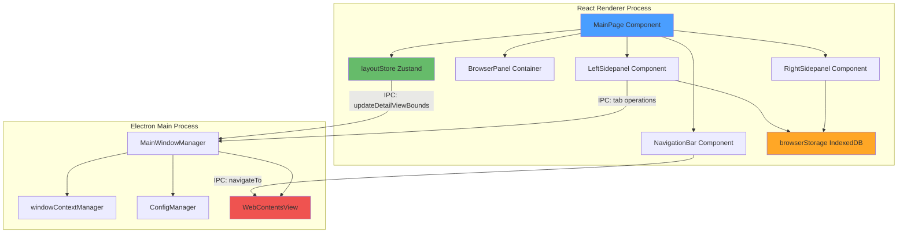
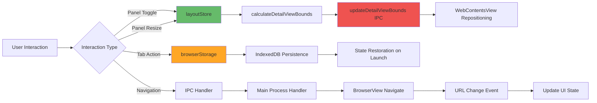
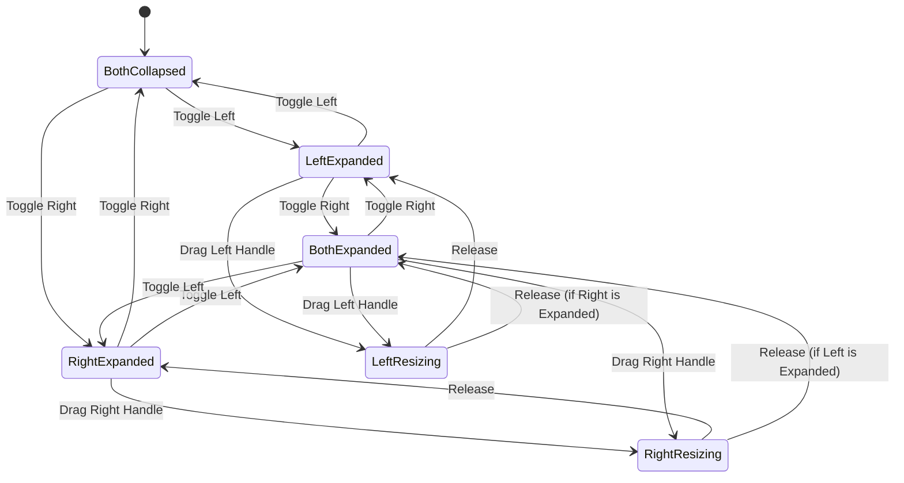
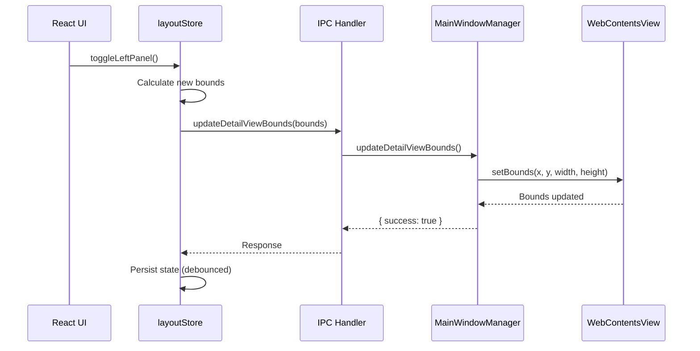

# Design Document: Dual Sidepanel Browser Layout

## Overview

This design document outlines the technical architecture for transforming the Manus Electron browser into a modern, Arc-style browsing experience with dual collapsible sidepanels. The system provides an enhanced browser interface with tab management (left panel), AI assistance (right panel), and a central browser preview area with top navigation controls.

### Design Goals

- **Flexible Workspace**: Independently toggleable and resizable panels for customized layouts
- **Seamless Integration**: Full compatibility with existing Electron IPC, state management, and browser automation
- **Performance Excellence**: 60fps animations with sub-50ms WebContentsView synchronization
- **Accessibility First**: WCAG 2.1 AA compliance with full keyboard navigation
- **SOLID Architecture**: Adherence to Single Responsibility, Open/Closed, and other SOLID principles

## Architecture Design

### System Architecture Diagram



### Data Flow Diagram



## Component Design

### Component Hierarchy

```
MainPage
├── NavigationBar
│   ├── BackButton
│   ├── ForwardButton
│   ├── RefreshButton
│   └── AddressBar
├── LeftSidepanel
│   ├── WorkspaceSelector
│   ├── TabList (react-window)
│   │   ├── TabItem (draggable)
│   │   └── PinnedTabItem
│   ├── FavoritesSection
│   └── NewTabButton
├── BrowserPanel (wrapper for WebContentsView)
├── ResizeHandle (left panel)
├── RightSidepanel
│   ├── AISidebarHeader
│   ├── MessageList
│   ├── StickyInputBox
│   └── SuggestionChips
└── ResizeHandle (right panel)
```

### Component 1: NavigationBar

**Responsibilities**: Top navigation controls for browser operations

**Interface**:
```typescript
interface NavigationBarProps {
  currentUrl: string;
  canGoBack: boolean;
  canGoForward: boolean;
  isLoading: boolean;
  onBack: () => void;
  onForward: () => void;
  onRefresh: () => void;
  onNavigate: (url: string) => void;
}
```

**Implementation Pattern**:
- Pure functional component with minimal state
- Uses IPC handlers for browser control: `navigateTo`, `goBack`, `goForward`, `reload`
- URL validation using regex patterns to distinguish URLs from search queries
- Keyboard shortcuts: Ctrl/Cmd+[ (back), Ctrl/Cmd+] (forward), Ctrl/Cmd+R (refresh), Ctrl/Cmd+L (focus address bar)

### Component 2: LeftSidepanel

**Responsibilities**: Tab management, workspace organization, favorites

**Interface**:
```typescript
interface LeftSidepanelProps {
  isExpanded: boolean;
  width: number; // 60px collapsed, 220-320px expanded
  tabs: BrowserTab[];
  workspaces: Workspace[];
  favorites: Favorite[];
  activeTabId: string;
  activeWorkspaceId: string;
  onToggle: () => void;
  onResize: (newWidth: number) => void;
  onTabSelect: (tabId: string) => void;
  onTabClose: (tabId: string) => void;
  onTabReorder: (draggedId: string, targetId: string) => void;
  onNewTab: () => void;
  onWorkspaceSwitch: (workspaceId: string) => void;
}

interface BrowserTab {
  id: string;
  title: string;
  url: string;
  favicon?: string;
  isPinned: boolean;
  workspaceId: string;
  createdAt: Date;
  lastAccessedAt: Date;
}

interface Workspace {
  id: string;
  name: string;
  color?: string;
  tabIds: string[];
  createdAt: Date;
}

interface Favorite {
  id: string;
  title: string;
  url: string;
  favicon?: string;
  order: number;
}
```

**Implementation Pattern**:
- Virtual scrolling with `react-window` for 100+ tabs
- Drag-and-drop using `react-beautiful-dnd`
- Tooltips on hover (500ms delay) for truncated titles
- IndexedDB persistence via `browserStorage` service
- Pinned tabs always at top, sorted by `lastAccessedAt`

### Component 3: BrowserPanel

**Responsibilities**: Wrapper container for Electron's WebContentsView

**Interface**:
```typescript
interface BrowserPanelProps {
  x: number;        // Left offset from window edge
  y: number;        // Top offset (navigation bar height)
  width: number;    // Calculated from panel states
  height: number;   // Window height - nav bar height
  minWidth: number; // 400px constraint
}
```

**Implementation Pattern**:
- Pure presentational component with no state
- Actual browser rendering handled by Electron BrowserView
- Coordinates with `windowContextManager` for multi-window scenarios
- Bounds updated via `updateDetailViewBounds` IPC handler

### Component 4: RightSidepanel

**Responsibilities**: AI agent interface with conversation history

**Interface**:
```typescript
interface RightSidepanelProps {
  isExpanded: boolean;
  width: number; // 0px collapsed, 300-500px expanded
  messages: Message[];
  currentTaskId: string;
  isTaskRunning: boolean;
  onToggle: () => void;
  onResize: (newWidth: number) => void;
  onSendMessage: (message: string) => void;
  onClearConversation: () => void;
  onAttachFile: (file: File) => void;
}

interface Message {
  id: string;
  type: 'user' | 'assistant' | 'system' | 'tool';
  content: string;
  timestamp: Date;
  metadata?: Record<string, any>;
}
```

**Implementation Pattern**:
- Sticky input box at bottom with `position: sticky`
- Auto-scroll to latest message when `isAtBottom` is true
- Message streaming via `eko-stream-message` IPC events
- Multi-line input: Shift+Enter for new line, Enter to send

### Component 5: ResizeHandle

**Responsibilities**: Interactive drag handle for panel resizing

**Interface**:
```typescript
interface ResizeHandleProps {
  orientation: 'vertical'; // Only vertical for sidepanels
  position: 'left' | 'right'; // Which panel edge
  onDragStart: () => void;
  onDrag: (deltaX: number) => void;
  onDragEnd: () => void;
  isActive: boolean;
}
```

**Implementation Pattern**:
- 4px visual width, 8px hit target for better UX
- Mouse cursor changes to `col-resize` on hover
- Real-time panel updates during drag (no debouncing)
- Constraints enforced by clamping values

### Component 6: MainPage (Orchestrator)

**Responsibilities**: Top-level layout orchestration and state coordination

**Key Methods**:
```typescript
class MainPageController {
  // Layout stage transitions
  handleLeftPanelToggle(): void
  handleRightPanelToggle(): void
  calculateLayoutStage(): LayoutStage

  // WebContentsView coordination
  updateBrowserViewBounds(): void
  syncPanelStateWithBrowserView(): void

  // Persistence
  savePanelState(): void
  restorePanelState(): void

  // Keyboard shortcuts
  registerGlobalShortcuts(): void
  handleShortcut(key: string): void
}
```

## State Management

### Zustand Store: layoutStore

```typescript
interface LayoutState {
  // Panel states
  leftPanel: {
    isExpanded: boolean;
    width: number; // 60 or 220-320
  };
  rightPanel: {
    isExpanded: boolean;
    width: number; // 0 or 300-500
  };

  // Browser preview
  browserPreview: {
    x: number;
    y: number;
    width: number;
    height: number;
  };

  // Layout stage
  currentStage: LayoutStage; // 1-6

  // Actions
  toggleLeftPanel: () => void;
  toggleRightPanel: () => void;
  resizeLeftPanel: (width: number) => void;
  resizeRightPanel: (width: number) => void;
  calculateBrowserBounds: () => DetailViewBounds;
  persistState: () => void;
  restoreState: () => void;
}

type LayoutStage =
  | 'both-collapsed'          // Stage 1
  | 'left-expanded'           // Stage 2
  | 'right-expanded'          // Stage 3
  | 'both-expanded'           // Stage 4
  | 'left-resizing'           // Stage 5
  | 'right-resizing';         // Stage 6
```

**State Transitions**:
```typescript
// Stage calculation based on panel states
function calculateStage(state: LayoutState): LayoutStage {
  const leftExpanded = state.leftPanel.isExpanded;
  const rightExpanded = state.rightPanel.isExpanded;

  if (!leftExpanded && !rightExpanded) return 'both-collapsed';
  if (leftExpanded && !rightExpanded) return 'left-expanded';
  if (!leftExpanded && rightExpanded) return 'right-expanded';
  if (leftExpanded && rightExpanded) return 'both-expanded';

  // Resizing stages determined by active drag handle
  return state.activeDragHandle === 'left' ? 'left-resizing' : 'right-resizing';
}
```

### IndexedDB Schema: browserStorage

```typescript
// Database: 'manus-browser-db', Version: 1

// Object Store: 'tabs'
interface TabRecord {
  id: string; // Primary key
  title: string;
  url: string;
  favicon?: string;
  isPinned: boolean;
  workspaceId: string;
  createdAt: number; // Timestamp
  lastAccessedAt: number;
  order: number; // For manual reordering
}

// Object Store: 'workspaces'
interface WorkspaceRecord {
  id: string; // Primary key
  name: string;
  color?: string;
  tabIds: string[]; // References to tabs
  createdAt: number;
  isActive: boolean;
}

// Object Store: 'favorites'
interface FavoriteRecord {
  id: string; // Primary key
  title: string;
  url: string;
  favicon?: string;
  order: number;
  createdAt: number;
}

// Indexes
// tabs: 'by-workspace' (workspaceId), 'by-pinned' (isPinned), 'by-lastAccessed' (lastAccessedAt)
// workspaces: 'by-active' (isActive)
// favorites: 'by-order' (order)
```

**Migration Strategy**:
```typescript
// Database version management
const DB_VERSION = 1;

function upgradeDatabase(event: IDBVersionChangeEvent) {
  const db = (event.target as IDBOpenDBRequest).result;

  if (event.oldVersion < 1) {
    // Create object stores
    const tabsStore = db.createObjectStore('tabs', { keyPath: 'id' });
    tabsStore.createIndex('by-workspace', 'workspaceId', { unique: false });
    tabsStore.createIndex('by-pinned', 'isPinned', { unique: false });
    tabsStore.createIndex('by-lastAccessed', 'lastAccessedAt', { unique: false });

    const workspacesStore = db.createObjectStore('workspaces', { keyPath: 'id' });
    workspacesStore.createIndex('by-active', 'isActive', { unique: false });

    const favoritesStore = db.createObjectStore('favorites', { keyPath: 'id' });
    favoritesStore.createIndex('by-order', 'order', { unique: false });
  }
}
```

### electron-store Schema: Layout Preferences

```typescript
// Stored in ~/.config/manus-electron/layout-prefs.json

interface LayoutPreferences {
  leftPanel: {
    isExpanded: boolean;
    width: number;
  };
  rightPanel: {
    isExpanded: boolean;
    width: number;
  };
  lastModified: number;
  version: number; // Schema version for migrations
}

// Default values
const DEFAULT_LAYOUT_PREFS: LayoutPreferences = {
  leftPanel: {
    isExpanded: false,
    width: 60,
  },
  rightPanel: {
    isExpanded: false,
    width: 0,
  },
  lastModified: Date.now(),
  version: 1,
};
```

## Layout Stages State Machine

### Stage Definitions

```typescript
enum LayoutStage {
  BOTH_COLLAPSED = 1,    // Left: 60px, Right: 0px
  LEFT_EXPANDED = 2,     // Left: 220-320px, Right: 0px
  RIGHT_EXPANDED = 3,    // Left: 60px, Right: 300-500px
  BOTH_EXPANDED = 4,     // Left: 220-320px, Right: 300-500px
  LEFT_RESIZING = 5,     // Left: Dynamically changing
  RIGHT_RESIZING = 6,    // Right: Dynamically changing
}
```

### State Machine Diagram



### Transition Handlers

```typescript
class LayoutStateMachine {
  private currentStage: LayoutStage;

  constructor() {
    this.currentStage = LayoutStage.BOTH_COLLAPSED;
  }

  // Transition: Toggle left panel
  toggleLeftPanel(): void {
    switch (this.currentStage) {
      case LayoutStage.BOTH_COLLAPSED:
        this.transitionTo(LayoutStage.LEFT_EXPANDED);
        break;
      case LayoutStage.LEFT_EXPANDED:
        this.transitionTo(LayoutStage.BOTH_COLLAPSED);
        break;
      case LayoutStage.RIGHT_EXPANDED:
        this.transitionTo(LayoutStage.BOTH_EXPANDED);
        break;
      case LayoutStage.BOTH_EXPANDED:
        this.transitionTo(LayoutStage.RIGHT_EXPANDED);
        break;
    }
  }

  // Transition: Toggle right panel
  toggleRightPanel(): void {
    switch (this.currentStage) {
      case LayoutStage.BOTH_COLLAPSED:
        this.transitionTo(LayoutStage.RIGHT_EXPANDED);
        break;
      case LayoutStage.LEFT_EXPANDED:
        this.transitionTo(LayoutStage.BOTH_EXPANDED);
        break;
      case LayoutStage.RIGHT_EXPANDED:
        this.transitionTo(LayoutStage.BOTH_COLLAPSED);
        break;
      case LayoutStage.BOTH_EXPANDED:
        this.transitionTo(LayoutStage.LEFT_EXPANDED);
        break;
    }
  }

  // Transition: Start resizing
  startResize(panel: 'left' | 'right'): void {
    if (panel === 'left') {
      this.transitionTo(LayoutStage.LEFT_RESIZING);
    } else {
      this.transitionTo(LayoutStage.RIGHT_RESIZING);
    }
  }

  // Transition: End resizing
  endResize(): void {
    const leftExpanded = this.isLeftPanelExpanded();
    const rightExpanded = this.isRightPanelExpanded();

    if (leftExpanded && rightExpanded) {
      this.transitionTo(LayoutStage.BOTH_EXPANDED);
    } else if (leftExpanded) {
      this.transitionTo(LayoutStage.LEFT_EXPANDED);
    } else if (rightExpanded) {
      this.transitionTo(LayoutStage.RIGHT_EXPANDED);
    } else {
      this.transitionTo(LayoutStage.BOTH_COLLAPSED);
    }
  }

  private transitionTo(newStage: LayoutStage): void {
    console.log(`Layout transition: ${LayoutStage[this.currentStage]} → ${LayoutStage[newStage]}`);
    this.currentStage = newStage;
    this.updateBrowserViewBounds();
    this.persistState();
  }

  private updateBrowserViewBounds(): void {
    // Calculate bounds and send to main process
    const bounds = this.calculateBrowserBounds();
    window.api.updateDetailViewBounds(bounds);
  }

  private calculateBrowserBounds(): DetailViewBounds {
    const windowWidth = window.innerWidth;
    const windowHeight = window.innerHeight;
    const navBarHeight = 60;

    const leftWidth = this.getLeftPanelWidth();
    const rightWidth = this.getRightPanelWidth();

    const x = leftWidth;
    const y = navBarHeight;
    const width = Math.max(400, windowWidth - leftWidth - rightWidth);
    const height = windowHeight - navBarHeight;

    return { x, y, width, height };
  }
}
```

## IPC Architecture

### New IPC Handlers

```typescript
// electron/main/ipc/layout-handlers.ts

import { ipcMain, IpcMainInvokeEvent } from 'electron';
import { MainWindowManager } from '../windows/main-window';
import { DetailViewBounds } from '@/type';

export function registerLayoutHandlers(mainWindowManager: MainWindowManager) {
  // Update WebContentsView bounds
  ipcMain.handle('updateDetailViewBounds', async (
    event: IpcMainInvokeEvent,
    bounds: DetailViewBounds
  ) => {
    try {
      await mainWindowManager.updateDetailViewBounds(bounds);
      return { success: true };
    } catch (error) {
      console.error('[IPC] Failed to update detail view bounds:', error);
      return { success: false, error: error.message };
    }
  });

  // Get current layout state (for debugging)
  ipcMain.handle('getLayoutState', async (event: IpcMainInvokeEvent) => {
    try {
      const state = mainWindowManager.getLayoutState();
      return { success: true, data: state };
    } catch (error) {
      console.error('[IPC] Failed to get layout state:', error);
      return { success: false, error: error.message };
    }
  });

  // Validate layout constraints
  ipcMain.handle('validateLayoutConstraints', async (
    event: IpcMainInvokeEvent,
    constraints: { leftWidth: number; rightWidth: number }
  ) => {
    try {
      const isValid = mainWindowManager.validateLayoutConstraints(constraints);
      return { success: true, data: { isValid } };
    } catch (error) {
      console.error('[IPC] Failed to validate constraints:', error);
      return { success: false, error: error.message };
    }
  });
}
```

### Existing IPC Handlers (Enhanced)

```typescript
// electron/main/ipc/browser-handlers.ts

// Enhanced navigateTo with tab context
ipcMain.handle('navigateTo', async (
  event: IpcMainInvokeEvent,
  url: string,
  tabId?: string
) => {
  try {
    const normalizedUrl = normalizeUrl(url);

    // Navigate the WebContentsView
    await mainWindowManager.navigateTo(normalizedUrl);

    // Update tab state if tabId provided
    if (tabId) {
      await mainWindowManager.updateTabUrl(tabId, normalizedUrl);
    }

    return { success: true, url: normalizedUrl };
  } catch (error) {
    console.error('[IPC] Navigation failed:', error);
    return { success: false, error: error.message };
  }
});

// Tab management handlers
ipcMain.handle('createTab', async (event: IpcMainInvokeEvent, tab: BrowserTab) => {
  // Implementation
});

ipcMain.handle('closeTab', async (event: IpcMainInvokeEvent, tabId: string) => {
  // Implementation
});

ipcMain.handle('switchTab', async (event: IpcMainInvokeEvent, tabId: string) => {
  // Implementation
});
```

### IPC Communication Flow



## WebContentsView Coordination

### Bounds Calculation

```typescript
// src/utils/detail-view-bounds.ts

import { DetailViewBounds, LayoutStage } from '@/type';

export function calculateDetailViewBounds(
  windowWidth: number,
  windowHeight: number,
  stage: LayoutStage,
  leftPanelWidth: number,
  rightPanelWidth: number
): DetailViewBounds {
  const NAV_BAR_HEIGHT = 60;
  const MIN_BROWSER_WIDTH = 400;

  // Calculate x (left offset)
  const x = leftPanelWidth;

  // Calculate y (top offset)
  const y = NAV_BAR_HEIGHT;

  // Calculate width (remaining space between panels)
  let width = windowWidth - leftPanelWidth - rightPanelWidth;

  // Enforce minimum width constraint
  if (width < MIN_BROWSER_WIDTH) {
    console.warn('[BoundsCalc] Browser width below minimum, clamping:', width, '→', MIN_BROWSER_WIDTH);
    width = MIN_BROWSER_WIDTH;

    // Adjust right panel width if needed
    const maxRightWidth = windowWidth - leftPanelWidth - MIN_BROWSER_WIDTH;
    if (rightPanelWidth > maxRightWidth) {
      console.warn('[BoundsCalc] Right panel exceeds available space, clamping');
      // This should trigger a layout store update to clamp right panel
    }
  }

  // Calculate height (full height minus nav bar)
  const height = windowHeight - NAV_BAR_HEIGHT;

  return { x, y, width, height };
}
```

### Synchronization Strategy

```typescript
// src/hooks/useWebContentsViewSync.ts

import { useEffect, useRef } from 'react';
import { useLayoutStore } from '@/stores/layoutStore';
import { calculateDetailViewBounds } from '@/utils/detail-view-bounds';

export function useWebContentsViewSync() {
  const layout = useLayoutStore();
  const pendingUpdateRef = useRef<boolean>(false);
  const retryCountRef = useRef<number>(0);

  useEffect(() => {
    // Skip if already updating
    if (pendingUpdateRef.current) return;

    // Mark as updating
    pendingUpdateRef.current = true;

    // Calculate bounds
    const bounds = calculateDetailViewBounds(
      window.innerWidth,
      window.innerHeight,
      layout.currentStage,
      layout.leftPanel.width,
      layout.rightPanel.width
    );

    // Update WebContentsView
    window.api.updateDetailViewBounds(bounds)
      .then(() => {
        console.log('[WebContentsView] Bounds updated successfully');
        retryCountRef.current = 0;
        pendingUpdateRef.current = false;
      })
      .catch((error) => {
        console.error('[WebContentsView] Failed to update bounds:', error);

        // Retry once after 100ms
        if (retryCountRef.current === 0) {
          retryCountRef.current++;
          setTimeout(() => {
            pendingUpdateRef.current = false;
            // Will trigger another update via useEffect
          }, 100);
        } else {
          // Max retries exceeded, show notification
          console.error('[WebContentsView] Max retries exceeded');
          pendingUpdateRef.current = false;
          retryCountRef.current = 0;

          // Notify user
          if (window.api.showNotification) {
            window.api.showNotification({
              title: 'Layout Error',
              body: 'Failed to update browser view. Please restart the application.',
              type: 'error'
            });
          }
        }
      });
  }, [
    layout.currentStage,
    layout.leftPanel.width,
    layout.rightPanel.width
  ]);
}
```

### Window Resize Handler

```typescript
// MainPage component

useEffect(() => {
  const handleWindowResize = () => {
    const bounds = calculateDetailViewBounds(
      window.innerWidth,
      window.innerHeight,
      layout.currentStage,
      layout.leftPanel.width,
      layout.rightPanel.width
    );

    window.api.updateDetailViewBounds(bounds).catch(error => {
      console.error('[WindowResize] Failed to update bounds:', error);
    });
  };

  window.addEventListener('resize', handleWindowResize);

  return () => {
    window.removeEventListener('resize', handleWindowResize);
  };
}, [layout]);
```

## CSS Architecture

### Design Tokens

```css
/* src/styles/design-tokens.css */

:root {
  /* Color Palette - Dark Theme */
  --base-darkest: #181818;
  --base-dark: #282828;
  --base-medium: #3C3C3C;
  --border-subtle: #333333;
  --border-standard: #404040;

  /* Text Colors */
  --text-primary: #FFFFFF;
  --text-secondary: #CCCCCC;
  --text-tertiary: #999999;

  /* Interactive Colors */
  --interactive-default: #4A9EFF;
  --interactive-hover: #66B2FF;
  --interactive-active: #2E7FD9;

  /* Semantic Colors */
  --success: #66BB6A;
  --warning: #FFA726;
  --error: #EF5350;
  --info: #42A5F5;

  /* Spacing Scale (8px base) */
  --space-1: 4px;
  --space-2: 8px;
  --space-3: 12px;
  --space-4: 16px;
  --space-5: 20px;
  --space-6: 24px;
  --space-8: 32px;
  --space-10: 40px;
  --space-12: 48px;

  /* Border Radius */
  --radius-sm: 4px;
  --radius-md: 8px;
  --radius-lg: 12px;
  --radius-xl: 16px;

  /* Shadows */
  --shadow-sm: 0 1px 2px rgba(0, 0, 0, 0.3);
  --shadow-md: 0 2px 4px rgba(0, 0, 0, 0.4);
  --shadow-lg: 0 4px 8px rgba(0, 0, 0, 0.5);

  /* Z-index Layers */
  --z-base: 1;
  --z-nav: 10;
  --z-panel: 20;
  --z-overlay: 30;
  --z-modal: 40;
  --z-toast: 50;

  /* Animation Durations */
  --duration-fast: 150ms;
  --duration-normal: 200ms;
  --duration-slow: 300ms;

  /* Animation Easings */
  --ease-in: cubic-bezier(0.4, 0, 1, 1);
  --ease-out: cubic-bezier(0, 0, 0.2, 1);
  --ease-in-out: cubic-bezier(0.4, 0, 0.2, 1);

  /* Panel Dimensions */
  --nav-bar-height: 60px;
  --left-panel-collapsed: 60px;
  --left-panel-default: 280px;
  --left-panel-min: 220px;
  --left-panel-max: 320px;
  --right-panel-collapsed: 0px;
  --right-panel-default: 400px;
  --right-panel-min: 300px;
  --right-panel-max: 500px;
  --browser-preview-min: 400px;
}
```

### Component Styles

```css
/* src/components/NavigationBar.module.css */

.navigationBar {
  height: var(--nav-bar-height);
  background: var(--base-dark);
  border-bottom: 1px solid var(--border-subtle);
  display: flex;
  align-items: center;
  padding: 0 var(--space-4);
  gap: var(--space-2);
  z-index: var(--z-nav);
}

.navControls {
  display: flex;
  gap: var(--space-2);
}

.navButton {
  width: 32px;
  height: 32px;
  border-radius: var(--radius-md);
  background: transparent;
  border: 1px solid transparent;
  color: var(--text-primary);
  cursor: pointer;
  transition: all var(--duration-normal) var(--ease-out);
}

.navButton:hover {
  background: var(--base-medium);
  border-color: var(--border-subtle);
}

.navButton:disabled {
  opacity: 0.4;
  cursor: not-allowed;
}

.addressBar {
  flex: 1;
  height: 36px;
  background: var(--base-medium);
  border: 1px solid var(--border-subtle);
  border-radius: var(--radius-md);
  padding: 0 var(--space-3);
  color: var(--text-primary);
  font-size: 14px;
  transition: border-color var(--duration-normal) var(--ease-out);
}

.addressBar:focus {
  outline: none;
  border-color: var(--interactive-default);
  box-shadow: 0 0 0 3px rgba(74, 158, 255, 0.1);
}
```

```css
/* src/components/LeftSidepanel.module.css */

.leftSidepanel {
  height: 100vh;
  background: var(--base-dark);
  border-right: 1px solid var(--border-subtle);
  display: flex;
  flex-direction: column;
  transition: width var(--duration-slow) var(--ease-in-out);
  z-index: var(--z-panel);
}

.leftSidepanel.collapsed {
  width: var(--left-panel-collapsed);
}

.leftSidepanel.expanded {
  width: var(--left-panel-default);
  min-width: var(--left-panel-min);
  max-width: var(--left-panel-max);
}

.tabList {
  flex: 1;
  overflow-y: auto;
  overflow-x: hidden;
  padding: var(--space-2) 0;
}

.tabItem {
  height: 48px;
  display: flex;
  align-items: center;
  gap: var(--space-2);
  padding: 0 var(--space-3);
  margin: 0 var(--space-2);
  border-radius: var(--radius-md);
  cursor: pointer;
  transition: all var(--duration-normal) var(--ease-out);
}

.tabItem:hover {
  background: var(--base-medium);
}

.tabItem.active {
  background: var(--base-medium);
  border-left: 3px solid var(--interactive-default);
}

.resizeHandle {
  position: absolute;
  right: -2px;
  top: 0;
  bottom: 0;
  width: 4px;
  background: transparent;
  cursor: col-resize;
  transition: background var(--duration-fast) var(--ease-out);
}

.resizeHandle::before {
  content: '';
  position: absolute;
  left: -2px;
  right: -2px;
  top: 0;
  bottom: 0;
}

.resizeHandle:hover,
.resizeHandle.active {
  background: var(--interactive-default);
}
```

## Animation Specifications

### Transition Timings

| Element | Duration | Easing | Notes |
|---------|----------|--------|-------|
| Panel expand/collapse | 300ms | ease-in-out | Smooth open/close |
| Panel resize | 0ms | none | Instant (follows mouse) |
| Tab switch | 150ms | ease-out | Quick tab activation |
| Hover effects | 200ms | ease-in-out | Button/element hover |
| Focus indicators | 150ms | ease-in-out | Keyboard focus ring |

### Animation Code

```css
/* src/styles/animations.css */

/* Panel toggle animation */
@keyframes panelExpand {
  from {
    width: var(--left-panel-collapsed);
    opacity: 0.8;
  }
  to {
    width: var(--left-panel-default);
    opacity: 1;
  }
}

@keyframes panelCollapse {
  from {
    width: var(--left-panel-default);
    opacity: 1;
  }
  to {
    width: var(--left-panel-collapsed);
    opacity: 0.8;
  }
}

/* Tab switch animation */
@keyframes tabSwitch {
  from {
    opacity: 0;
    transform: translateX(-8px);
  }
  to {
    opacity: 1;
    transform: translateX(0);
  }
}

/* Focus ring animation */
@keyframes focusRing {
  from {
    box-shadow: 0 0 0 0 var(--interactive-default);
  }
  to {
    box-shadow: 0 0 0 3px rgba(74, 158, 255, 0.2);
  }
}

/* Reduced motion preferences */
@media (prefers-reduced-motion: reduce) {
  *,
  *::before,
  *::after {
    animation-duration: 0.01ms !important;
    animation-iteration-count: 1 !important;
    transition-duration: 0.01ms !important;
  }
}
```

## Accessibility Features

### Keyboard Navigation

```typescript
// src/hooks/useKeyboardShortcuts.ts

import { useEffect } from 'react';
import { useLayoutStore } from '@/stores/layoutStore';

export function useKeyboardShortcuts() {
  const layout = useLayoutStore();

  useEffect(() => {
    const handleKeyDown = (event: KeyboardEvent) => {
      const isMac = navigator.platform.includes('Mac');
      const modKey = isMac ? event.metaKey : event.ctrlKey;

      // Ctrl/Cmd+L: Focus address bar
      if (modKey && event.key === 'l') {
        event.preventDefault();
        document.getElementById('address-bar')?.focus();
      }

      // Ctrl/Cmd+/: Focus AI input
      if (modKey && event.key === '/') {
        event.preventDefault();
        document.getElementById('ai-input')?.focus();
      }

      // Ctrl/Cmd+B: Toggle left panel
      if (modKey && event.key === 'b') {
        event.preventDefault();
        layout.toggleLeftPanel();
      }

      // Ctrl/Cmd+Shift+B: Toggle right panel
      if (modKey && event.shiftKey && event.key === 'B') {
        event.preventDefault();
        layout.toggleRightPanel();
      }

      // Ctrl/Cmd+T: New tab
      if (modKey && event.key === 't') {
        event.preventDefault();
        layout.createNewTab();
      }

      // Ctrl/Cmd+W: Close tab
      if (modKey && event.key === 'w') {
        event.preventDefault();
        layout.closeActiveTab();
      }

      // Ctrl/Cmd+[: Back
      if (modKey && event.key === '[') {
        event.preventDefault();
        window.api.goBack();
      }

      // Ctrl/Cmd+]: Forward
      if (modKey && event.key === ']') {
        event.preventDefault();
        window.api.goForward();
      }

      // Ctrl/Cmd+R: Refresh
      if (modKey && event.key === 'r') {
        event.preventDefault();
        window.api.reload();
      }
    };

    window.addEventListener('keydown', handleKeyDown);

    return () => {
      window.removeEventListener('keydown', handleKeyDown);
    };
  }, [layout]);
}
```

### ARIA Labels Example

```tsx
// Example: NavigationBar with ARIA
<nav className="navigation-bar" role="navigation" aria-label="Browser navigation">
  <button
    className="nav-button"
    onClick={handleBack}
    disabled={!canGoBack}
    aria-label="Go back"
    aria-disabled={!canGoBack}
  >
    <BackIcon />
  </button>

  <button
    className="nav-button"
    onClick={handleForward}
    disabled={!canGoForward}
    aria-label="Go forward"
    aria-disabled={!canGoForward}
  >
    <ForwardIcon />
  </button>

  <input
    id="address-bar"
    className="address-bar"
    type="text"
    value={currentUrl}
    onChange={handleUrlChange}
    onKeyDown={handleUrlSubmit}
    placeholder="Enter URL or search query"
    aria-label="Address bar"
    role="combobox"
    aria-autocomplete="list"
    aria-expanded={showSuggestions}
  />
</nav>
```

### Focus Management

```typescript
// src/utils/focus-management.ts

export class FocusManager {
  private focusableElements: HTMLElement[] = [];
  private currentIndex: number = -1;

  constructor(private container: HTMLElement) {
    this.updateFocusableElements();
  }

  updateFocusableElements(): void {
    const selector = [
      'a[href]',
      'button:not([disabled])',
      'input:not([disabled])',
      'select:not([disabled])',
      'textarea:not([disabled])',
      '[tabindex]:not([tabindex="-1"])'
    ].join(',');

    this.focusableElements = Array.from(
      this.container.querySelectorAll<HTMLElement>(selector)
    );
  }

  focusNext(): void {
    this.currentIndex = (this.currentIndex + 1) % this.focusableElements.length;
    this.focusableElements[this.currentIndex]?.focus();
  }

  focusPrevious(): void {
    this.currentIndex =
      (this.currentIndex - 1 + this.focusableElements.length) %
      this.focusableElements.length;
    this.focusableElements[this.currentIndex]?.focus();
  }

  focusFirst(): void {
    this.currentIndex = 0;
    this.focusableElements[0]?.focus();
  }

  focusLast(): void {
    this.currentIndex = this.focusableElements.length - 1;
    this.focusableElements[this.currentIndex]?.focus();
  }
}
```

## Performance Optimizations

### Virtual Scrolling

```typescript
// src/components/VirtualTabList.tsx

import { FixedSizeList as List } from 'react-window';
import AutoSizer from 'react-virtualized-auto-sizer';

interface VirtualTabListProps {
  tabs: BrowserTab[];
  activeTabId: string;
  onTabSelect: (tabId: string) => void;
}

export function VirtualTabList({ tabs, activeTabId, onTabSelect }: VirtualTabListProps) {
  const ROW_HEIGHT = 48;

  const Row = ({ index, style }: { index: number; style: React.CSSProperties }) => {
    const tab = tabs[index];
    const isActive = tab.id === activeTabId;

    return (
      <div
        style={style}
        className={`tab-item ${isActive ? 'active' : ''}`}
        onClick={() => onTabSelect(tab.id)}
      >
        
        <span className="tab-title">{tab.title}</span>
      </div>
    );
  };

  return (
    <AutoSizer>
      {({ height, width }) => (
        <List
          height={height}
          itemCount={tabs.length}
          itemSize={ROW_HEIGHT}
          width={width}
          overscanCount={5}
        >
          {Row}
        </List>
      )}
    </AutoSizer>
  );
}
```

### Debounced Persistence

```typescript
// src/utils/debounce.ts

export function debounce<T extends (...args: any[]) => any>(
  func: T,
  delay: number
): (...args: Parameters<T>) => void {
  let timeoutId: NodeJS.Timeout | null = null;

  return function debounced(...args: Parameters<T>) {
    if (timeoutId) {
      clearTimeout(timeoutId);
    }

    timeoutId = setTimeout(() => {
      func(...args);
      timeoutId = null;
    }, delay);
  };
}

// Usage in layoutStore
const debouncedPersist = debounce((state: LayoutState) => {
  // Save to electron-store
  window.api.saveLayoutPreferences({
    leftPanel: state.leftPanel,
    rightPanel: state.rightPanel,
    lastModified: Date.now(),
  });
}, 500); // 500ms debounce
```

### RequestAnimationFrame for Resize

```typescript
// src/components/ResizeHandle.tsx

export function ResizeHandle({ onDrag }: ResizeHandleProps) {
  const rafIdRef = useRef<number | null>(null);
  const isDraggingRef = useRef<boolean>(false);
  const lastXRef = useRef<number>(0);

  const handleMouseMove = (event: MouseEvent) => {
    if (!isDraggingRef.current) return;

    // Cancel previous frame
    if (rafIdRef.current) {
      cancelAnimationFrame(rafIdRef.current);
    }

    // Schedule update for next frame
    rafIdRef.current = requestAnimationFrame(() => {
      const deltaX = event.clientX - lastXRef.current;
      lastXRef.current = event.clientX;
      onDrag(deltaX);
    });
  };

  const handleMouseDown = (event: React.MouseEvent) => {
    isDraggingRef.current = true;
    lastXRef.current = event.clientX;

    document.addEventListener('mousemove', handleMouseMove);
    document.addEventListener('mouseup', handleMouseUp);
  };

  const handleMouseUp = () => {
    isDraggingRef.current = false;

    // Cancel any pending frame
    if (rafIdRef.current) {
      cancelAnimationFrame(rafIdRef.current);
      rafIdRef.current = null;
    }

    document.removeEventListener('mousemove', handleMouseMove);
    document.removeEventListener('mouseup', handleMouseUp);
  };

  return (
    <div
      className="resize-handle"
      onMouseDown={handleMouseDown}
    />
  );
}
```

## Error Handling Strategies

### Error Boundaries

```typescript
// src/components/ErrorBoundary.tsx

import React, { Component, ErrorInfo, ReactNode } from 'react';

interface ErrorBoundaryProps {
  children: ReactNode;
  fallback?: ReactNode;
  onError?: (error: Error, errorInfo: ErrorInfo) => void;
}

interface ErrorBoundaryState {
  hasError: boolean;
  error: Error | null;
}

export class ErrorBoundary extends Component<ErrorBoundaryProps, ErrorBoundaryState> {
  constructor(props: ErrorBoundaryProps) {
    super(props);
    this.state = { hasError: false, error: null };
  }

  static getDerivedStateFromError(error: Error): ErrorBoundaryState {
    return { hasError: true, error };
  }

  componentDidCatch(error: Error, errorInfo: ErrorInfo): void {
    console.error('[ErrorBoundary] Caught error:', error, errorInfo);

    // Call custom error handler
    this.props.onError?.(error, errorInfo);

    // Send error to logging service (if configured)
    if (window.api?.logError) {
      window.api.logError({
        message: error.message,
        stack: error.stack,
        componentStack: errorInfo.componentStack,
      });
    }
  }

  render(): ReactNode {
    if (this.state.hasError) {
      return this.props.fallback || (
        <div className="error-boundary-fallback">
          <h2>Something went wrong</h2>
          <p>{this.state.error?.message}</p>
          <button onClick={() => window.location.reload()}>
            Reload Application
          </button>
        </div>
      );
    }

    return this.props.children;
  }
}
```

### IPC Error Handling

```typescript
// src/utils/ipc-error-handler.ts

export class IPCError extends Error {
  constructor(
    message: string,
    public code: string,
    public context?: Record<string, any>
  ) {
    super(message);
    this.name = 'IPCError';
  }
}

export async function safeIPCCall<T>(
  operation: () => Promise<T>,
  fallback?: T
): Promise<T> {
  try {
    return await operation();
  } catch (error) {
    console.error('[IPC] Operation failed:', error);

    // Log to main process
    if (window.api?.logError) {
      window.api.logError({
        type: 'ipc',
        message: error.message,
        stack: error.stack,
      });
    }

    if (fallback !== undefined) {
      return fallback;
    }

    throw new IPCError(
      `IPC operation failed: ${error.message}`,
      'IPC_CALL_FAILED',
      { originalError: error }
    );
  }
}

// Usage example
const result = await safeIPCCall(
  () => window.api.updateDetailViewBounds(bounds),
  { success: false } // Fallback value
);
```

### Graceful Degradation

```typescript
// src/components/LeftSidepanel.tsx

export function LeftSidepanel(props: LeftSidepanelProps) {
  const [storageAvailable, setStorageAvailable] = useState(true);

  useEffect(() => {
    // Test IndexedDB availability
    const testStorage = async () => {
      try {
        await browserStorage.testConnection();
        setStorageAvailable(true);
      } catch (error) {
        console.error('[Storage] IndexedDB unavailable, using in-memory storage');
        setStorageAvailable(false);

        // Show warning to user
        window.api?.showNotification?.({
          title: 'Storage Warning',
          body: 'Tab data will not persist across sessions.',
          type: 'warning'
        });
      }
    };

    testStorage();
  }, []);

  const handleTabAction = async (action: () => Promise<void>) => {
    try {
      await action();
    } catch (error) {
      console.error('[TabAction] Failed:', error);

      // Fallback to in-memory operation
      if (!storageAvailable) {
        console.log('[TabAction] Using in-memory fallback');
        // Execute action without persistence
      }
    }
  };

  return (
    // Component JSX with conditional features based on storageAvailable
  );
}
```

## File Structure

```
src/
├── components/
│   ├── NavigationBar.tsx           # Top navigation bar with browser controls
│   ├── NavigationBar.module.css
│   ├── LeftSidepanel.tsx           # Enhanced left panel with tabs/workspaces
│   ├── LeftSidepanel.module.css
│   ├── RightSidepanel.tsx          # Enhanced right panel with AI agent
│   ├── RightSidepanel.module.css
│   ├── BrowserPanel.tsx            # Browser preview container (existing, enhanced)
│   ├── BrowserPanel.module.css
│   ├── ResizeHandle.tsx            # Drag handle for panel resizing (existing)
│   ├── ResizeHandle.module.css
│   ├── VirtualTabList.tsx          # Virtual scrolling for tab list
│   ├── WorkspaceSelector.tsx       # Workspace dropdown selector
│   ├── FavoritesSection.tsx        # Favorites/pinned items section
│   └── ErrorBoundary.tsx           # Error boundary wrapper
│
├── stores/
│   └── layoutStore.ts              # Zustand store for layout state (new)
│
├── services/
│   └── browserStorage.ts           # IndexedDB service for tabs/workspaces (new)
│
├── utils/
│   ├── detail-view-bounds.ts       # Bounds calculation utility (existing, enhanced)
│   ├── panel-layout-storage.ts     # electron-store persistence (existing, enhanced)
│   ├── url-validation.ts           # URL parsing and validation (new)
│   ├── debounce.ts                 # Debounce utility (new)
│   ├── focus-management.ts         # Focus management utility (new)
│   └── ipc-error-handler.ts        # IPC error handling wrapper (new)
│
├── hooks/
│   ├── useKeyboardShortcuts.ts     # Global keyboard shortcuts (new)
│   ├── useWebContentsViewSync.ts   # WebContentsView synchronization (new)
│   ├── useLayoutMode.ts            # Layout mode management (existing)
│   └── useTabManagement.ts         # Tab operations hook (new)
│
├── styles/
│   ├── design-tokens.css           # CSS custom properties (new)
│   ├── animations.css              # Animation keyframes (new)
│   └── globals.css                 # Global styles (existing, enhanced)
│
├── pages/
│   └── main.tsx                    # Main page component (existing, refactored)
│
└── type.d.ts                       # Type definitions (existing, enhanced)

electron/
└── main/
    └── ipc/
        └── layout-handlers.ts      # New IPC handlers for layout operations
```

---

**Document Version**: 1.0
**Last Updated**: 2025-11-08
**Status**: Ready for Review
