# Implementation Tasks: Dual Sidepanel Browser Layout

## Overview

This document provides a comprehensive implementation plan for transforming the Manus Electron browser into a modern, Arc-style browsing experience with dual collapsible sidepanels. Tasks are organized into three sprints, with each task containing clear acceptance criteria, estimated effort, and dependencies.

---

## Sprint 1: Foundation & Core Infrastructure (Days 1-5)

### Phase 1.1: Type Definitions & Data Models

- [ ] **Task 1.1.1: Create TypeScript type definitions for layout system**
  - **Description**: Define all TypeScript interfaces and types for the layout system including panel states, browser tabs, workspaces, and favorites
  - **Files to Create/Modify**:
    - `src/type.d.ts` (enhance existing)
  - **Acceptance Criteria**:
    - `LayoutState` interface defined with leftPanel, rightPanel, browserPreview, and currentStage properties
    - `LayoutStage` type defined as union of 6 stage strings
    - `DetailViewBounds` interface defined with x, y, width, height properties
    - `BrowserTab` interface defined with id, title, url, favicon, isPinned, workspaceId, timestamps
    - `Workspace` interface defined with id, name, color, tabIds, createdAt
    - `Favorite` interface defined with id, title, url, favicon, order
    - All types exported and available for import
  - **Estimated Effort**: 2 hours
  - **Dependencies**: None
  - **Requirements Reference**: 1, 2, 3, 8, 12

- [ ] **Task 1.1.2: Create IndexedDB schema and database initialization**
  - **Description**: Define IndexedDB database schema for tabs, workspaces, and favorites with proper indexes
  - **Files to Create/Modify**:
    - `src/services/browserStorage.ts` (new)
  - **Acceptance Criteria**:
    - Database named `manus-browser-db` with version 1
    - Object stores created: `tabs`, `workspaces`, `favorites`
    - Indexes created: `by-workspace`, `by-pinned`, `by-lastAccessed` for tabs
    - Indexes created: `by-active` for workspaces, `by-order` for favorites
    - Database upgrade handler implemented with version management
    - Basic CRUD operations defined for each store
    - Error handling for database connection failures
  - **Estimated Effort**: 4 hours
  - **Dependencies**: Task 1.1.1
  - **Requirements Reference**: 8, 12

### Phase 1.2: State Management

- [ ] **Task 1.2.1: Create layoutStore with Zustand**
  - **Description**: Implement Zustand store for managing panel states, layout stages, and browser preview bounds
  - **Files to Create/Modify**:
    - `src/stores/layoutStore.ts` (new)
  - **Acceptance Criteria**:
    - Store includes leftPanel state (isExpanded, width)
    - Store includes rightPanel state (isExpanded, width)
    - Store includes browserPreview state (x, y, width, height)
    - Store includes currentStage computed property
    - Actions implemented: toggleLeftPanel, toggleRightPanel
    - Actions implemented: resizeLeftPanel, resizeRightPanel
    - Action implemented: calculateBrowserBounds
    - Persistence methods: persistState, restoreState
    - Width constraints enforced (min/max for each panel)
    - Minimum browser width (400px) constraint enforced
  - **Estimated Effort**: 6 hours
  - **Dependencies**: Task 1.1.1
  - **Requirements Reference**: 5, 7, 11, 12

- [ ] **Task 1.2.2: Implement electron-store persistence for layout preferences**
  - **Description**: Create utility functions to save and restore layout preferences using electron-store
  - **Files to Create/Modify**:
    - `src/utils/panel-layout-storage.ts` (enhance existing)
  - **Acceptance Criteria**:
    - `saveLayoutPreferences()` function saves panel states to electron-store
    - `loadLayoutPreferences()` function restores panel states
    - Default values provided for first-time users
    - Schema version tracking implemented for migrations
    - Debounced save (500ms) to prevent excessive disk I/O
    - Validation of loaded data against schema constraints
    - Graceful fallback to defaults if storage fails
  - **Estimated Effort**: 3 hours
  - **Dependencies**: Task 1.2.1
  - **Requirements Reference**: 11, 12

### Phase 1.3: Core Layout Components

- [ ] **Task 1.3.1: Create NavigationBar component**
  - **Description**: Build top navigation bar with back/forward/refresh controls and address bar
  - **Files to Create/Modify**:
    - `src/components/NavigationBar.tsx` (new)
    - `src/components/NavigationBar.module.css` (new)
  - **Acceptance Criteria**:
    - Component renders 60px height bar spanning full width
    - Back button rendered with disabled state when no history
    - Forward button rendered with disabled state when no next page
    - Refresh button always enabled
    - Address bar accepts URL input and search queries
    - URL validation distinguishes URLs from search queries
    - Enter key triggers navigation
    - Keyboard shortcuts work: Ctrl/Cmd+[ (back), Ctrl/Cmd+] (forward), Ctrl/Cmd+R (refresh)
    - ARIA labels and roles implemented for accessibility
    - Visual focus indicators on keyboard navigation
  - **Estimated Effort**: 6 hours
  - **Dependencies**: Task 1.1.1
  - **Requirements Reference**: 1, 10

- [ ] **Task 1.3.2: Create DualPanelLayout wrapper component**
  - **Description**: Create main orchestrator component that manages overall layout and coordinates all panels
  - **Files to Create/Modify**:
    - `src/components/DualPanelLayout.tsx` (new)
    - `src/components/DualPanelLayout.module.css` (new)
  - **Acceptance Criteria**:
    - Component accepts children props for panels and browser preview
    - Layout renders NavigationBar at top
    - Layout positions left panel, browser preview, and right panel correctly
    - WebContentsView bounds calculated on every layout change
    - Window resize handler updates bounds within 50ms
    - Layout stage transitions handled smoothly
    - Error boundary wraps entire layout
  - **Estimated Effort**: 5 hours
  - **Dependencies**: Task 1.2.1, Task 1.3.1
  - **Requirements Reference**: 4, 7, 11

### Phase 1.4: IPC Handlers

- [ ] **Task 1.4.1: Implement IPC handler for updateDetailViewBounds**
  - **Description**: Create or enhance IPC handler to update WebContentsView bounds from renderer process
  - **Files to Create/Modify**:
    - `electron/main/ipc/layout-handlers.ts` (new)
    - `electron/main/windows/main-window.ts` (enhance existing)
    - `electron/preload/index.ts` (enhance existing)
  - **Acceptance Criteria**:
    - `updateDetailViewBounds` handler registered in main process
    - Handler accepts DetailViewBounds object { x, y, width, height }
    - Handler updates WebContentsView using MainWindowManager
    - Retry logic implemented (1 retry after 100ms delay)
    - Error responses returned with success flag and error message
    - Preload script exposes `window.api.updateDetailViewBounds()` method
    - TypeScript types updated in `src/type.d.ts`
  - **Estimated Effort**: 4 hours
  - **Dependencies**: Task 1.1.1
  - **Requirements Reference**: 4, 13

- [ ] **Task 1.4.2: Create utility for WebContentsView bounds calculation**
  - **Description**: Implement pure function to calculate WebContentsView bounds based on panel states
  - **Files to Create/Modify**:
    - `src/utils/detail-view-bounds.ts` (enhance existing)
  - **Acceptance Criteria**:
    - `calculateDetailViewBounds()` function accepts window dimensions and panel widths
    - Function returns DetailViewBounds object
    - Navigation bar height (60px) subtracted from y coordinate
    - Left panel width subtracted from x coordinate
    - Browser width calculated as: window width - left width - right width
    - Minimum browser width (400px) enforced with warning logs
    - Function is pure with no side effects
    - Unit tests cover all layout stages
  - **Estimated Effort**: 3 hours
  - **Dependencies**: Task 1.1.1
  - **Requirements Reference**: 4, 13

---

## Sprint 2: Panel Components & Interactions (Days 6-10)

### Phase 2.1: Enhanced Left Sidebar

- [ ] **Task 2.1.1: Enhance LeftSidebar component with expand/collapse functionality**
  - **Description**: Refactor existing LeftSidebar to support collapsible state with smooth transitions
  - **Files to Create/Modify**:
    - `src/components/LeftSidepanel.tsx` (enhance existing LeftSidebar)
    - `src/components/LeftSidepanel.module.css` (new)
  - **Acceptance Criteria**:
    - Component accepts isExpanded and width props
    - Collapsed state renders 60px width with icon-only view
    - Expanded state renders 220-320px width with full content
    - Toggle button visible and functional in both states
    - Smooth CSS transition (300ms ease-in-out) between states
    - Tooltips show on hover in collapsed state (500ms delay)
    - Component integrates with layoutStore
    - Background color matches design spec (#282828)
  - **Estimated Effort**: 6 hours
  - **Dependencies**: Task 1.2.1, Task 1.3.2
  - **Requirements Reference**: 2, 5, 7

- [ ] **Task 2.1.2: Create TabList with virtual scrolling**
  - **Description**: Implement virtual scrolling tab list using react-window for performance with 100+ tabs
  - **Files to Create/Modify**:
    - `src/components/VirtualTabList.tsx` (new)
    - `src/components/TabItem.tsx` (new)
    - `src/components/TabItem.module.css` (new)
  - **Acceptance Criteria**:
    - VirtualTabList uses react-window FixedSizeList
    - AutoSizer adjusts to container dimensions
    - Row height fixed at 48px
    - TabItem displays favicon (16x16), title, and close button
    - Active tab highlighted with distinct styling
    - Pinned tabs appear at top of list
    - Overscan set to 5 items for smooth scrolling
    - Performance tested with 100+ tabs (no visible lag)
  - **Estimated Effort**: 8 hours
  - **Dependencies**: Task 2.1.1
  - **Requirements Reference**: 2, 8, 11

- [ ] **Task 2.1.3: Implement tab drag-and-drop reordering**
  - **Description**: Add drag-and-drop functionality for reordering tabs using react-beautiful-dnd
  - **Files to Create/Modify**:
    - `src/components/VirtualTabList.tsx` (enhance)
    - `src/hooks/useTabManagement.ts` (new)
  - **Acceptance Criteria**:
    - Tabs can be dragged within the tab list
    - Visual drop indicator shows target position
    - Tab order persisted to IndexedDB after reorder
    - Pinned tabs cannot be moved to unpinned section
    - Drag handle accessible via keyboard (Space to grab)
    - Smooth animation during reorder
    - Works with virtual scrolling
  - **Estimated Effort**: 6 hours
  - **Dependencies**: Task 2.1.2, Task 1.1.2
  - **Requirements Reference**: 2, 8

- [ ] **Task 2.1.4: Create WorkspaceSelector component**
  - **Description**: Build dropdown selector for switching between workspace groups
  - **Files to Create/Modify**:
    - `src/components/WorkspaceSelector.tsx` (new)
    - `src/components/WorkspaceSelector.module.css` (new)
  - **Acceptance Criteria**:
    - Dropdown displays all available workspaces
    - Active workspace highlighted
    - Switching workspaces filters tab list (200ms transition)
    - Create new workspace option available
    - Rename workspace option available
    - Delete workspace option with confirmation
    - Keyboard navigation supported (arrow keys, Enter)
    - Workspace state persisted to IndexedDB
  - **Estimated Effort**: 5 hours
  - **Dependencies**: Task 1.1.2, Task 2.1.1
  - **Requirements Reference**: 2, 8, 12

- [ ] **Task 2.1.5: Create FavoritesSection component**
  - **Description**: Build favorites/pinned items section with drag-to-pin functionality
  - **Files to Create/Modify**:
    - `src/components/FavoritesSection.tsx` (new)
    - `src/components/FavoritesSection.module.css` (new)
  - **Acceptance Criteria**:
    - Section displays all favorited items
    - Items show favicon and title
    - Drag-and-drop to add/remove favorites
    - Manual reordering supported
    - Star icon indicates favorited state
    - Click to navigate to favorited URL
    - Favorites persisted to IndexedDB
    - Section collapsible in expanded view
  - **Estimated Effort**: 5 hours
  - **Dependencies**: Task 1.1.2, Task 2.1.1
  - **Requirements Reference**: 2, 8, 12

### Phase 2.2: Enhanced Right Sidebar

- [ ] **Task 2.2.1: Enhance RightSidebar component with expand/collapse functionality**
  - **Description**: Extract and enhance right sidebar from main.tsx with collapsible behavior
  - **Files to Create/Modify**:
    - `src/components/RightSidepanel.tsx` (new, extracted from main.tsx)
    - `src/components/RightSidepanel.module.css` (new)
  - **Acceptance Criteria**:
    - Component accepts isExpanded and width props
    - Collapsed state renders 0px width (completely hidden)
    - Expanded state renders 300-500px width
    - Toggle button remains visible when collapsed
    - Smooth CSS transition (300ms ease-in-out)
    - Header displays "Loᥫ᭡li Agent" label (52px height)
    - Clear and minimize buttons functional
    - Component integrates with layoutStore
    - Background color matches design spec (#282828)
  - **Estimated Effort**: 5 hours
  - **Dependencies**: Task 1.2.1, Task 1.3.2
  - **Requirements Reference**: 3, 5, 7, 9

- [ ] **Task 2.2.2: Create StickyInputBox component**
  - **Description**: Build sticky input box at bottom of AI sidebar with multi-line support
  - **Files to Create/Modify**:
    - `src/components/StickyInputBox.tsx` (new)
    - `src/components/StickyInputBox.module.css` (new)
  - **Acceptance Criteria**:
    - Input box positioned at bottom with position: sticky
    - Minimum height 80px
    - Textarea supports multi-line input
    - Shift+Enter inserts new line
    - Enter key sends message
    - Send button visible and functional
    - Attachment button opens file picker
    - Input remains visible during scroll
    - Auto-resize as content grows
    - Keyboard accessible with ARIA labels
  - **Estimated Effort**: 4 hours
  - **Dependencies**: Task 2.2.1
  - **Requirements Reference**: 3, 9

- [ ] **Task 2.2.3: Implement suggestion chips**
  - **Description**: Create suggestion chip components for quick prompt selection
  - **Files to Create/Modify**:
    - `src/components/SuggestionChips.tsx` (new)
    - `src/components/SuggestionChips.module.css` (new)
  - **Acceptance Criteria**:
    - Chips display below input box (32px height)
    - Clicking chip populates input with prompt text
    - Chips configurable via props
    - Horizontal scrolling if chips exceed width
    - Keyboard navigation supported
    - Chips hidden when input focused (optional UX enhancement)
  - **Estimated Effort**: 3 hours
  - **Dependencies**: Task 2.2.2
  - **Requirements Reference**: 3, 9

- [ ] **Task 2.2.4: Implement auto-scroll for conversation area**
  - **Description**: Add logic to automatically scroll conversation to latest message
  - **Files to Create/Modify**:
    - `src/components/RightSidepanel.tsx` (enhance)
    - `src/hooks/useAutoScroll.ts` (new)
  - **Acceptance Criteria**:
    - Conversation area scrolls to bottom on new message
    - Scroll behavior: smooth
    - User can manually scroll up without auto-scroll interference
    - Auto-scroll only triggers if user is near bottom (within 50px)
    - Performance optimized with useRef and useEffect
    - Works with message streaming
  - **Estimated Effort**: 3 hours
  - **Dependencies**: Task 2.2.1
  - **Requirements Reference**: 3, 9

### Phase 2.3: Resize Handles

- [ ] **Task 2.3.1: Create ResizeHandle component for left panel**
  - **Description**: Build drag handle for resizing left panel with visual feedback
  - **Files to Create/Modify**:
    - `src/components/ResizeHandle.tsx` (enhance existing or create new)
    - `src/components/ResizeHandle.module.css` (new)
  - **Acceptance Criteria**:
    - Handle positioned on right edge of left panel (4px visual, 8px hit target)
    - Cursor changes to col-resize on hover
    - Drag operation updates panel width in real-time (no debouncing)
    - requestAnimationFrame used for smooth 60fps updates
    - Width constraints enforced (220-320px for left panel)
    - Browser preview minimum width (400px) respected
    - Visual highlight on hover and active drag
    - Keyboard accessible (arrow keys to resize)
  - **Estimated Effort**: 5 hours
  - **Dependencies**: Task 1.2.1
  - **Requirements Reference**: 5, 11

- [ ] **Task 2.3.2: Create ResizeHandle component for right panel**
  - **Description**: Build drag handle for resizing right panel with visual feedback
  - **Files to Create/Modify**:
    - `src/components/ResizeHandle.tsx` (enhance)
    - `src/components/ResizeHandle.module.css` (enhance)
  - **Acceptance Criteria**:
    - Handle positioned on left edge of right panel (4px visual, 8px hit target)
    - Cursor changes to col-resize on hover
    - Drag operation updates panel width in real-time
    - requestAnimationFrame used for 60fps updates
    - Width constraints enforced (300-500px for right panel)
    - Browser preview minimum width (400px) respected
    - Visual highlight on hover and active drag
    - Keyboard accessible
  - **Estimated Effort**: 4 hours
  - **Dependencies**: Task 2.3.1
  - **Requirements Reference**: 5, 11

- [ ] **Task 2.3.3: Implement ResizeHandleManager for coordinating both handles**
  - **Description**: Create manager component to coordinate left and right resize handles preventing conflicts
  - **Files to Create/Modify**:
    - `src/components/ResizeHandleManager.tsx` (new)
  - **Acceptance Criteria**:
    - Only one handle active at a time
    - Global mouse events captured during drag
    - Mouse cursor persists during drag (prevents cursor flicker)
    - Constraints enforced across both panels
    - Layout stage transitions handled (to LEFT_RESIZING or RIGHT_RESIZING)
    - Debounced persistence to electron-store after drag ends
    - Works correctly with window resize events
  - **Estimated Effort**: 4 hours
  - **Dependencies**: Task 2.3.1, Task 2.3.2
  - **Requirements Reference**: 5, 7, 11

---

## Sprint 3: Integration, Polish & Testing (Days 11-15)

### Phase 3.1: Main Page Integration

- [ ] **Task 3.1.1: Refactor main.tsx to use DualPanelLayout**
  - **Description**: Integrate all layout components into main.tsx and remove legacy layout code
  - **Files to Create/Modify**:
    - `src/pages/main.tsx` (refactor existing)
  - **Acceptance Criteria**:
    - Legacy layout code removed
    - DualPanelLayout component imported and used
    - NavigationBar integrated at top
    - LeftSidepanel integrated with full features
    - RightSidepanel integrated with AI agent
    - BrowserPanel wrapper positioned correctly
    - Layout state restored on page load
    - No breaking changes to existing features (browser automation, task scheduling)
  - **Estimated Effort**: 6 hours
  - **Dependencies**: All Phase 2 tasks
  - **Requirements Reference**: All requirements

- [ ] **Task 3.1.2: Implement useWebContentsViewSync hook**
  - **Description**: Create React hook to synchronize WebContentsView with layout state changes
  - **Files to Create/Modify**:
    - `src/hooks/useWebContentsViewSync.ts` (new)
  - **Acceptance Criteria**:
    - Hook monitors layoutStore changes
    - Bounds recalculated on every layout change
    - updateDetailViewBounds IPC called with new bounds
    - Retry logic implemented (1 retry after 100ms)
    - Error notifications shown after max retries
    - Performance optimized (no unnecessary recalculations)
    - Pending update flag prevents duplicate calls
  - **Estimated Effort**: 4 hours
  - **Dependencies**: Task 1.4.1, Task 1.4.2
  - **Requirements Reference**: 4, 11, 13

- [ ] **Task 3.1.3: Implement useKeyboardShortcuts hook**
  - **Description**: Create global keyboard shortcuts handler for all layout actions
  - **Files to Create/Modify**:
    - `src/hooks/useKeyboardShortcuts.ts` (new)
  - **Acceptance Criteria**:
    - Ctrl/Cmd+L: Focus address bar
    - Ctrl/Cmd+/: Focus AI input
    - Ctrl/Cmd+B: Toggle left panel
    - Ctrl/Cmd+Shift+B: Toggle right panel
    - Ctrl/Cmd+T: New tab
    - Ctrl/Cmd+W: Close tab
    - Ctrl/Cmd+[: Browser back
    - Ctrl/Cmd+]: Browser forward
    - Ctrl/Cmd+R: Browser refresh
    - Platform detection (Mac vs Windows/Linux)
    - Event.preventDefault() called to prevent browser defaults
    - Shortcuts work in all layout stages
  - **Estimated Effort**: 3 hours
  - **Dependencies**: Task 3.1.1
  - **Requirements Reference**: 6, 10

### Phase 3.2: Styling & Animations

- [ ] **Task 3.2.1: Create design tokens CSS file**
  - **Description**: Define all CSS custom properties for colors, spacing, and dimensions
  - **Files to Create/Modify**:
    - `src/styles/design-tokens.css` (new)
  - **Acceptance Criteria**:
    - Color palette defined (dark theme only)
    - Text colors defined (primary, secondary, tertiary)
    - Interactive colors defined (default, hover, active)
    - Semantic colors defined (success, warning, error, info)
    - Spacing scale defined (8px base)
    - Border radius values defined
    - Shadow styles defined
    - Z-index layers defined
    - Animation durations and easings defined
    - Panel dimension constants defined
  - **Estimated Effort**: 2 hours
  - **Dependencies**: None
  - **Requirements Reference**: Design Specs

- [ ] **Task 3.2.2: Implement animation keyframes**
  - **Description**: Create CSS animations for panel transitions and interactions
  - **Files to Create/Modify**:
    - `src/styles/animations.css` (new)
  - **Acceptance Criteria**:
    - panelExpand keyframe defined (300ms ease-in-out)
    - panelCollapse keyframe defined (300ms ease-in-out)
    - tabSwitch keyframe defined (150ms ease-out)
    - focusRing keyframe defined (150ms ease-in-out)
    - Reduced motion media query implemented
    - Animations maintain 60fps on reference hardware
  - **Estimated Effort**: 3 hours
  - **Dependencies**: Task 3.2.1
  - **Requirements Reference**: 11

- [ ] **Task 3.2.3: Apply styling to all layout components**
  - **Description**: Ensure all components use design tokens and follow design specifications
  - **Files to Create/Modify**:
    - All component CSS modules
    - `src/styles/globals.css` (enhance existing)
  - **Acceptance Criteria**:
    - All components use CSS custom properties from design-tokens.css
    - Color palette matches design spec exactly
    - Spacing follows 8px base grid
    - Typography hierarchy consistent
    - Focus indicators visible on all interactive elements (3:1 contrast)
    - Hover states implemented for all buttons
    - Border colors and styles consistent
    - No hard-coded color values in component styles
  - **Estimated Effort**: 5 hours
  - **Dependencies**: Task 3.2.1, Task 3.2.2
  - **Requirements Reference**: Design Specs, Accessibility

### Phase 3.3: State Persistence & Restoration

- [ ] **Task 3.3.1: Implement tab state persistence to IndexedDB**
  - **Description**: Save and restore tab data across browser sessions
  - **Files to Create/Modify**:
    - `src/services/browserStorage.ts` (enhance)
    - `src/hooks/useTabManagement.ts` (enhance)
  - **Acceptance Criteria**:
    - Tab created/updated/deleted operations persist to IndexedDB
    - Debounced persistence (500ms) to prevent excessive writes
    - Tab data includes: id, title, url, favicon, isPinned, workspaceId, timestamps
    - All tabs restored on application launch (within 500ms)
    - Error handling with graceful fallback to in-memory storage
    - Warning notification shown if persistence fails
    - Migration function for schema version upgrades
  - **Estimated Effort**: 6 hours
  - **Dependencies**: Task 1.1.2, Task 2.1.2
  - **Requirements Reference**: 8, 12

- [ ] **Task 3.3.2: Implement workspace state persistence**
  - **Description**: Save and restore workspace configurations across sessions
  - **Files to Create/Modify**:
    - `src/services/browserStorage.ts` (enhance)
    - `src/hooks/useWorkspaceManagement.ts` (new)
  - **Acceptance Criteria**:
    - Workspace data persisted: id, name, color, tabIds, createdAt, isActive
    - Active workspace restored on launch
    - Tab associations maintained across restarts
    - Create, rename, delete operations persist immediately
    - Validation prevents orphaned tabs
    - Error handling with fallback to default workspace
  - **Estimated Effort**: 5 hours
  - **Dependencies**: Task 1.1.2, Task 2.1.4, Task 3.3.1
  - **Requirements Reference**: 8, 12

- [ ] **Task 3.3.3: Implement favorites state persistence**
  - **Description**: Save and restore favorites/pinned items across sessions
  - **Files to Create/Modify**:
    - `src/services/browserStorage.ts` (enhance)
  - **Acceptance Criteria**:
    - Favorites data persisted: id, title, url, favicon, order
    - Order preserved across restarts
    - Add/remove operations persist immediately
    - Reordering persisted (debounced 500ms)
    - Error handling with fallback to empty favorites
  - **Estimated Effort**: 3 hours
  - **Dependencies**: Task 1.1.2, Task 2.1.5
  - **Requirements Reference**: 8, 12

- [ ] **Task 3.3.4: Implement layout preferences restoration on launch**
  - **Description**: Restore panel states and dimensions when application starts
  - **Files to Create/Modify**:
    - `src/stores/layoutStore.ts` (enhance)
    - `src/pages/main.tsx` (enhance)
  - **Acceptance Criteria**:
    - Layout preferences loaded from electron-store within 200ms
    - Panel states (collapsed/expanded) restored correctly
    - Panel widths restored within constraints
    - Fallback to defaults if stored data invalid
    - WebContentsView bounds updated immediately after restoration
    - No visual flash during restoration
  - **Estimated Effort**: 4 hours
  - **Dependencies**: Task 1.2.2, Task 3.1.1
  - **Requirements Reference**: 7, 11, 12

### Phase 3.4: Error Handling & Accessibility

- [ ] **Task 3.4.1: Create ErrorBoundary component**
  - **Description**: Implement React error boundary to catch and handle component errors gracefully
  - **Files to Create/Modify**:
    - `src/components/ErrorBoundary.tsx` (new)
  - **Acceptance Criteria**:
    - ErrorBoundary catches all React component errors
    - Fallback UI displays error message and reload button
    - Error logged to console with stack trace
    - Error sent to main process via IPC (if available)
    - Custom error handler callback supported
    - Does not catch errors in event handlers (documented)
  - **Estimated Effort**: 3 hours
  - **Dependencies**: None
  - **Requirements Reference**: Maintainability

- [ ] **Task 3.4.2: Implement IPC error handling wrapper**
  - **Description**: Create utility for consistent IPC error handling with fallback values
  - **Files to Create/Modify**:
    - `src/utils/ipc-error-handler.ts` (new)
  - **Acceptance Criteria**:
    - `safeIPCCall()` function wraps IPC operations
    - Catches all IPC errors and logs them
    - Returns fallback value if operation fails
    - Custom IPCError class with error codes
    - Error context included for debugging
    - Retry logic optional via parameter
  - **Estimated Effort**: 2 hours
  - **Dependencies**: None
  - **Requirements Reference**: Maintainability

- [ ] **Task 3.4.3: Implement focus management utility**
  - **Description**: Create utility for managing keyboard focus across layout components
  - **Files to Create/Modify**:
    - `src/utils/focus-management.ts` (new)
  - **Acceptance Criteria**:
    - FocusManager class tracks all focusable elements
    - focusNext() and focusPrevious() methods implemented
    - focusFirst() and focusLast() methods implemented
    - Skips disabled elements automatically
    - Updates focusable elements dynamically
    - Works with Tab and Shift+Tab navigation
  - **Estimated Effort**: 3 hours
  - **Dependencies**: None
  - **Requirements Reference**: 6

- [ ] **Task 3.4.4: Add ARIA labels to all interactive elements**
  - **Description**: Ensure all buttons, inputs, and interactive elements have proper ARIA labels and roles
  - **Files to Create/Modify**:
    - All component files (enhance)
  - **Acceptance Criteria**:
    - All buttons have aria-label attributes
    - All inputs have aria-label or associated label elements
    - Interactive elements have appropriate role attributes
    - Panel states announced via aria-live regions
    - Tab list has role="tablist" and proper ARIA relationships
    - Address bar has role="combobox" with aria-autocomplete
    - Focus indicators visible (3:1 contrast minimum)
    - Tested with screen reader (NVDA, JAWS, or VoiceOver)
  - **Estimated Effort**: 5 hours
  - **Dependencies**: All Phase 2 tasks
  - **Requirements Reference**: 6

### Phase 3.5: Testing & Bug Fixes

- [ ] **Task 3.5.1: Test all 6 layout stage transitions**
  - **Description**: Manually test all possible layout stage transitions for smooth animations and correct bounds
  - **Files to Create/Modify**:
    - None (testing only)
  - **Acceptance Criteria**:
    - Stage 1 (both collapsed) renders correctly
    - Stage 2 (left expanded) renders correctly
    - Stage 3 (right expanded) renders correctly
    - Stage 4 (both expanded) renders correctly
    - Stage 5 (left resizing) works smoothly at 60fps
    - Stage 6 (right resizing) works smoothly at 60fps
    - All transitions complete within 300ms ±10ms
    - WebContentsView remains synchronized in all stages
    - No visual glitches during transitions
    - Browser preview maintains 400px minimum width
  - **Estimated Effort**: 4 hours
  - **Dependencies**: Task 3.1.1, Task 3.1.2
  - **Requirements Reference**: 7, 11

- [ ] **Task 3.5.2: Test tab management features**
  - **Description**: Test all tab operations including create, close, switch, reorder, pin, and workspace management
  - **Files to Create/Modify**:
    - None (testing only)
  - **Acceptance Criteria**:
    - New tab creation works (Ctrl/Cmd+T and + button)
    - Tab closing works (Ctrl/Cmd+W and close button)
    - Tab switching works (click and keyboard navigation)
    - Tab reordering works via drag-and-drop
    - Tab pinning works and persists
    - Workspace switching filters tabs correctly
    - Favorites add/remove works
    - All operations persist across browser restarts
    - Virtual scrolling performs well with 100+ tabs
  - **Estimated Effort**: 4 hours
  - **Dependencies**: Task 3.3.1, Task 3.3.2, Task 3.3.3
  - **Requirements Reference**: 2, 8, 12

- [ ] **Task 3.5.3: Test keyboard navigation and shortcuts**
  - **Description**: Verify all keyboard shortcuts work correctly and tab order is logical
  - **Files to Create/Modify**:
    - None (testing only)
  - **Acceptance Criteria**:
    - Tab key navigates in logical order: nav controls → address bar → left panel → main preview → right panel
    - All keyboard shortcuts work as documented
    - Focus indicators visible on all focusable elements
    - Escape key closes modals/dropdowns
    - Arrow keys navigate tab list
    - Enter activates focused element
    - Space toggles checkboxes/buttons
    - Skip navigation link accessible
  - **Estimated Effort**: 3 hours
  - **Dependencies**: Task 3.1.3, Task 3.4.3
  - **Requirements Reference**: 6

- [ ] **Task 3.5.4: Test error handling and edge cases**
  - **Description**: Test error scenarios and edge cases to ensure graceful degradation
  - **Files to Create/Modify**:
    - None (testing only)
  - **Acceptance Criteria**:
    - IndexedDB failure fallbacks to in-memory storage
    - electron-store failure uses default values
    - IPC handler failures show error notifications
    - Invalid URLs display error in address bar
    - Network errors handled gracefully
    - Window resize below minimum handled correctly
    - Panel resize exceeding constraints clamped properly
    - ErrorBoundary catches component errors
    - Storage corruption recovered via migration
  - **Estimated Effort**: 4 hours
  - **Dependencies**: Task 3.4.1, Task 3.4.2
  - **Requirements Reference**: Maintainability

- [ ] **Task 3.5.5: Performance profiling and optimization**
  - **Description**: Profile performance using Chrome DevTools and optimize bottlenecks
  - **Files to Create/Modify**:
    - Various files based on profiling results
  - **Acceptance Criteria**:
    - Layout initialization completes within 500ms
    - Panel resize maintains 60fps (measured via Performance profiler)
    - Panel toggle animations complete within 300ms
    - WebContentsView bounds update within 50ms
    - Tab list with 100+ tabs renders without lag
    - Memory usage under 200MB for layout components
    - No memory leaks detected over 5-minute session
    - Storage operations complete within timeouts
  - **Estimated Effort**: 6 hours
  - **Dependencies**: Task 3.1.1
  - **Requirements Reference**: 11

- [ ] **Task 3.5.6: Cross-platform testing (macOS, Windows, Linux)**
  - **Description**: Test layout on all supported platforms to ensure consistent behavior
  - **Files to Create/Modify**:
    - Platform-specific bug fixes as needed
  - **Acceptance Criteria**:
    - Layout renders identically on macOS 11+
    - Layout renders identically on Windows 10+
    - Layout renders identically on Linux (Ubuntu 20.04+)
    - Keyboard shortcuts work on all platforms (Cmd vs Ctrl)
    - Window resize behavior consistent
    - Panel persistence works on all platforms
    - No platform-specific visual glitches
  - **Estimated Effort**: 4 hours
  - **Dependencies**: Task 3.1.1
  - **Requirements Reference**: Compatibility

- [ ] **Task 3.5.7: Regression testing for existing features**
  - **Description**: Verify all existing features still work after layout changes
  - **Files to Create/Modify**:
    - None (testing only)
  - **Acceptance Criteria**:
    - Browser automation (Eko agent) works correctly
    - Task scheduling functions properly
    - All IPC handlers respond correctly
    - Multi-model AI support unchanged
    - TTS and speech recognition work
    - Social media integrations (Xiaohongshu, Douyin) functional
    - File agent operations work
    - User preferences persist correctly
    - Window management (tray, menu) works
    - i18n language switching functions
  - **Estimated Effort**: 5 hours
  - **Dependencies**: Task 3.1.1
  - **Requirements Reference**: Compatibility

---

## Task Dependency Diagram

To facilitate parallel execution by multiple agents, here's the task dependency graph showing which tasks can be executed in parallel:

```mermaid
flowchart TD
    T111[Task 1.1.1: Type definitions]
    T112[Task 1.1.2: IndexedDB schema]
    T121[Task 1.2.1: layoutStore]
    T122[Task 1.2.2: electron-store]
    T131[Task 1.3.1: NavigationBar]
    T132[Task 1.3.2: DualPanelLayout]
    T141[Task 1.4.1: IPC handlers]
    T142[Task 1.4.2: Bounds calculation]

    T211[Task 2.1.1: LeftSidepanel expand/collapse]
    T212[Task 2.1.2: TabList virtual scrolling]
    T213[Task 2.1.3: Drag-and-drop]
    T214[Task 2.1.4: WorkspaceSelector]
    T215[Task 2.1.5: FavoritesSection]

    T221[Task 2.2.1: RightSidepanel expand/collapse]
    T222[Task 2.2.2: StickyInputBox]
    T223[Task 2.2.3: Suggestion chips]
    T224[Task 2.2.4: Auto-scroll]

    T231[Task 2.3.1: Left ResizeHandle]
    T232[Task 2.3.2: Right ResizeHandle]
    T233[Task 2.3.3: ResizeHandleManager]

    T311[Task 3.1.1: main.tsx refactor]
    T312[Task 3.1.2: useWebContentsViewSync]
    T313[Task 3.1.3: useKeyboardShortcuts]

    T321[Task 3.2.1: Design tokens]
    T322[Task 3.2.2: Animations]
    T323[Task 3.2.3: Component styling]

    T331[Task 3.3.1: Tab persistence]
    T332[Task 3.3.2: Workspace persistence]
    T333[Task 3.3.3: Favorites persistence]
    T334[Task 3.3.4: Layout restoration]

    T341[Task 3.4.1: ErrorBoundary]
    T342[Task 3.4.2: IPC error handler]
    T343[Task 3.4.3: Focus management]
    T344[Task 3.4.4: ARIA labels]

    T351[Task 3.5.1: Layout testing]
    T352[Task 3.5.2: Tab testing]
    T353[Task 3.5.3: Keyboard testing]
    T354[Task 3.5.4: Error testing]
    T355[Task 3.5.5: Performance profiling]
    T356[Task 3.5.6: Cross-platform testing]
    T357[Task 3.5.7: Regression testing]

    %% Sprint 1 dependencies
    T111 --> T112
    T111 --> T121
    T111 --> T131
    T111 --> T141
    T111 --> T142

    T121 --> T122
    T121 --> T132
    T131 --> T132

    %% Sprint 2 dependencies
    T121 --> T211
    T132 --> T211
    T211 --> T212
    T212 --> T213
    T112 --> T213

    T112 --> T214
    T211 --> T214

    T112 --> T215
    T211 --> T215

    T121 --> T221
    T132 --> T221
    T221 --> T222
    T222 --> T223
    T221 --> T224

    T121 --> T231
    T231 --> T232
    T231 --> T233
    T232 --> T233

    %% Sprint 3 dependencies
    T211 --> T311
    T212 --> T311
    T213 --> T311
    T214 --> T311
    T215 --> T311
    T221 --> T311
    T222 --> T311
    T223 --> T311
    T224 --> T311
    T231 --> T311
    T232 --> T311
    T233 --> T311

    T141 --> T312
    T142 --> T312

    T311 --> T313

    T321 --> T322
    T321 --> T323
    T322 --> T323

    T112 --> T331
    T212 --> T331

    T112 --> T332
    T214 --> T332
    T331 --> T332

    T112 --> T333
    T215 --> T333

    T122 --> T334
    T311 --> T334

    T311 --> T351
    T312 --> T351

    T331 --> T352
    T332 --> T352
    T333 --> T352

    T313 --> T353
    T343 --> T353

    T341 --> T354
    T342 --> T354

    T311 --> T355
    T311 --> T356
    T311 --> T357

    %% Parallel groups
    style T111 fill:#e1f5fe
    style T321 fill:#e1f5fe
    style T341 fill:#e1f5fe
    style T342 fill:#e1f5fe
    style T343 fill:#e1f5fe

    style T212 fill:#c8e6c9
    style T214 fill:#c8e6c9
    style T215 fill:#c8e6c9

    style T222 fill:#fff9c4
    style T223 fill:#fff9c4
    style T224 fill:#fff9c4

    style T231 fill:#ffccbc
    style T232 fill:#ffccbc
```

**Parallel Execution Groups:**

- **Group 1 (Sprint 1, can run in parallel):**
  - Task 1.1.1, Task 1.4.2, Task 3.2.1, Task 3.4.1, Task 3.4.2, Task 3.4.3

- **Group 2 (Sprint 2 Left Panel, can run in parallel after dependencies):**
  - Task 2.1.2, Task 2.1.4, Task 2.1.5

- **Group 3 (Sprint 2 Right Panel, can run in parallel after dependencies):**
  - Task 2.2.2, Task 2.2.3, Task 2.2.4

- **Group 4 (Sprint 2 Resize, can run in parallel):**
  - Task 2.3.1, Task 2.3.2

- **Group 5 (Sprint 3 Testing, can run in parallel after Task 3.1.1):**
  - Task 3.5.5, Task 3.5.6, Task 3.5.7

---

## Estimated Total Effort

| Sprint | Phase | Tasks | Total Hours | Days (8h/day) |
|--------|-------|-------|-------------|---------------|
| Sprint 1 | Foundation | 10 tasks | 39 hours | 4.9 days |
| Sprint 2 | Components | 13 tasks | 63 hours | 7.9 days |
| Sprint 3 | Integration | 19 tasks | 72 hours | 9.0 days |
| **Total** | **All** | **42 tasks** | **174 hours** | **21.8 days** |

**Note:** Estimates assume a single developer working full-time. Parallel execution by multiple developers can significantly reduce calendar time.

---

## Key Notes for Implementation

### SOLID Principles Adherence

All components must follow SOLID principles as defined in CLAUDE.md:

- **Single Responsibility**: Each component has one clear purpose
- **Open/Closed**: Use interfaces and composition for extensibility
- **Liskov Substitution**: Subclasses must honor parent contracts
- **Interface Segregation**: Small, focused interfaces
- **Dependency Inversion**: Depend on abstractions, not implementations

### Performance Targets

- **60fps**: All animations and resize operations
- **500ms**: Layout initialization
- **300ms**: Panel toggle animations
- **50ms**: WebContentsView bounds updates
- **200MB**: Maximum memory for layout components

### Accessibility Requirements

- **WCAG 2.1 Level AA** compliance mandatory
- All interactive elements keyboard accessible
- Focus indicators with 3:1 contrast minimum
- ARIA labels on all controls
- Screen reader compatible

### Testing Strategy

Each task should include:
1. Unit tests for pure functions
2. Integration tests for component interactions
3. Manual testing for visual verification
4. Performance profiling for critical paths
5. Accessibility audit with automated tools

### Breaking Changes

**ZERO BREAKING CHANGES ALLOWED**

All existing features must continue to function:
- Browser automation (Eko agent)
- Task scheduling
- IPC communication
- AI provider configurations
- Voice features (TTS, speech recognition)
- Social media integrations
- File operations
- Window management

### Documentation Requirements

Each completed task should update:
- Inline code comments (JSDoc)
- Component README if complex
- Type definitions in type.d.ts
- Error messages with helpful context

---

## Success Criteria Summary

Implementation is considered complete when:

✅ All 42 tasks completed with passing acceptance criteria
✅ All 6 layout stages transition smoothly at 60fps
✅ Panel state persists across sessions with 100% accuracy
✅ Tab management fully functional (create, close, switch, reorder, pin)
✅ Workspace and favorites features working
✅ AI agent interface functional with improved UX
✅ Navigation controls work correctly
✅ WebContentsView synchronized at all times
✅ Keyboard navigation works for all elements
✅ WCAG 2.1 Level AA compliance achieved
✅ Zero breaking changes to existing features
✅ All unit tests passing with 70%+ coverage
✅ Performance targets met on reference hardware
✅ Cross-platform compatibility verified

---

**Document Version**: 1.0
**Last Updated**: 2025-11-08
**Status**: Ready for Implementation
